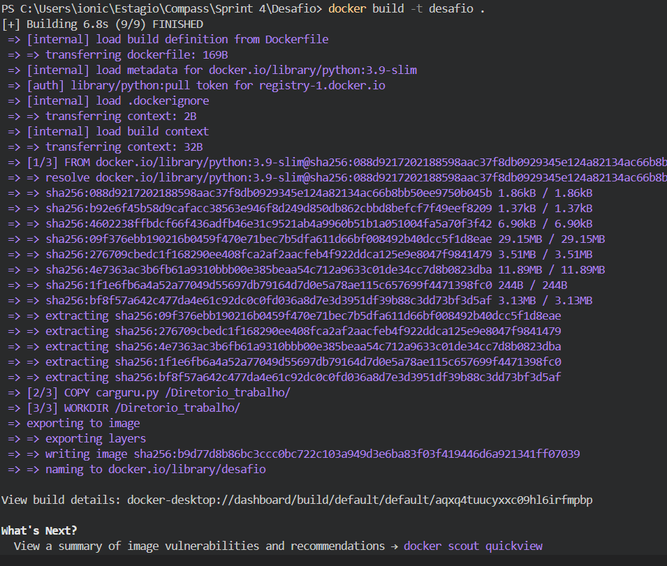
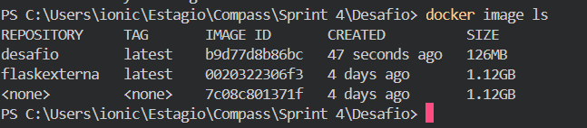

# Exercícios

[ex01](Exercicios/E01.py)
[ex02](Exercicios/E02.py)
[ex03](Exercicios/E03.py)
[ex04](Exercicios/E04.py)
[ex05](Exercicios/E05.py)
[ex06](Exercicios/E06.py)
[ex07](Exercicios/E07.py)

# Evidências

## Build da imagem

## Imagem salva

## Execução container

## Build da imagem mascarar dados

## Imagem mascarar dados salva

## Execução macarar dados

## Comandos para buildas/criar

[Comandos](Desafio/comandos%20para%20execução.txt)

# Certificados

[certificadoAWS1](Certificado/13246_3_5302791_1715802599_AWS%20Course%20Completion%20Certificate.pdf)

[certificadoAWS2](Certificado/1851_3_5302791_1715798334_AWS%20Course%20Completion%20Certificate.pdf)

