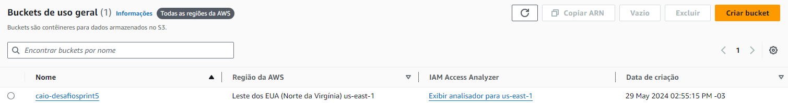
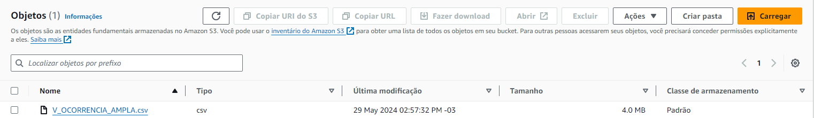
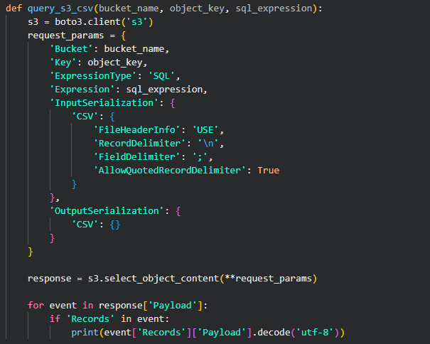
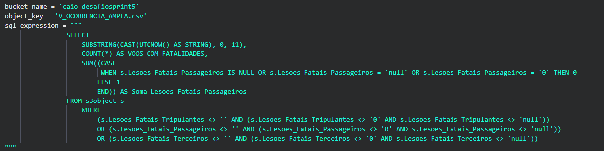
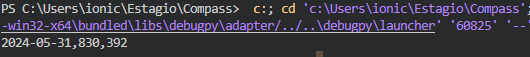

## Introdução

Para o desafio da sprint 5 foi pedido que um dataset fosse escolhido e enviado para um Bucket S3 na AWS, e uma consulta deveria ser feita por meio dele

### Arquivo escolhido

o arquivo escolhido foi um csv de ocorrencias aeronauticas que pode ser encontrado nesse [link](https://dados.gov.br/dados/conjuntos-dados/ocorrncias-aeronuticas).
[clique aqui](V_OCORRENCIA_AMPLA.csv) para ver o arquivo (o arquivo original tem uma linhas a mais que mostra a ultima atualização, ela foi apagada para facilitar as operações).

O arquivo mostra ocorrencias aeronauticas onde contem informações como acidentes, lesões, fatalidades, operador e diversas outras, além de mostrar a data em que a ocorrencia ocorreu.

### Processo

Após a escolha do CSV fui criar o bucket na AWS

Com o bucket criado upei o arquivo nele

Com tudo isso precisava configurar as credenciais de acesso ao Bucket, usei o comando SET no CMD, como foi fornecido e orientado pela AWS, fazendo com que durante aquela sessão, o acesso ao arquivo funcionasse tranquilamente, sem precisar colocar os tokens explicitos no codigo.

Já desenvolvendo o [codigo](ScriptBoto.py), configuro o necessario para o funcionamento da consulta.

e essa foi a consulta que desenvolvi

Atendendo os requisitos pedidos para uma unica consulta:
Uma Cláusula que filta dados usando ao menos dois operadores lógicos.
Duas funções de agregação: Count(*) e Sum().
Uma função condicional: CASE WHEN
Uma função de conversão: CAST()
Uma função de data: UTCNOW()
Uma função de String: SUBSTRING()

## Resultado

Onde o primeiro atributo representa a data em que foi feita a consulta.
O segundo representa a quantidade de acidentes com vitimas fatais.
O terceiro representa quantos dos acidentes com vitimas fatais tiveram passageiros como vitimas.
